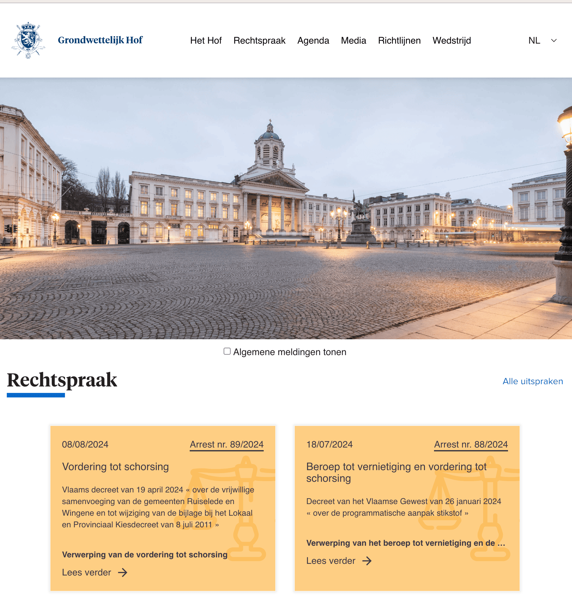

## Migration from Nuxt 2 to Nuxt 3 with compatibility version 4

### Prerequisites

* Node.js >= 18.0.0
* npm 
* Git repository
* Ubuntu 20.04.6 LTS server

### Migration Considerations

* **Nuxt:** `compatibilityVersion: 4`
* **API Server:** Migrate Fastify to Nuxt 3's built-in Nitro server
* **State Management:** migrate from Vuex to Pinia
* **Databases:** MariaDB with Knex and Filemaker API
* **UI:** Upgrade Vuetify versus Tailwind
* **Data Fetching:** Replace Axios with built-in `useFetch`, `useAsyncData`, `$fetch`
* **Validation:** Drop vee-validate & vuelidate
* **Cookies:** Drop cookie-universal & cookie-universal-nuxt
* **.env**: replace `.env.production` and `.env.development` with a single `.env` file and utilize runtime variables on server to simplify DX

### Migration Strategy

1. **Key Challenges**
    * **i18n:** Implement for multi-language support
    * **@nuxt/content v2:** Adapt to Nuxt 3's Content module changes
    * **UI:** Vuetify latest version, significant migration process ?
    * **Routing:** Port Fastify routes to Nuxt API routes
    * **Database:** Integrate MySQL using Knex
    * **Juportal:** API for the Juportal robot
    * **Search:** Solr integration
    * **Auth:** FAS/CSAM (Federal Authentication Service/Common Secure Access Management) authentication with the Belgian e-id

2. **Dependencies**
    * Carefully select the needed dependencies and remove the unneeded.

3. **Plugins and Middleware**
    * Limited in scope, address as needed 
     
4. **Next Steps**
    * **migrate Vuetify** Use npm install `eslint-plugin-vuetify --save-dev --legacy-peer-deps` ?
    * **migrate Nuxt content in content/nl, etc**
    * **copy assets, fonts and other config files f.ex. with constants and utils**
    * **Components and Pages:** Migrate and adapt to Nuxt 3
    * **Composition API:** Convert Options API
    * **Testing:** Implement unit, integration, and E2E tests (Vue Test Utils / Vitest / Cypress)

### Work in Progress: here we focus on the framework and less on the content.

- **Install Nuxt 3 with Compatibility Version 4**
  - [X] Create the folder structure: move `public` to `static`, and `assets` to `app/assets`.
  - [X] Set up basic files: `app.vue`, `layouts/default.vue`, and `pages/index.vue`.

- **Redirect Nuxt 4 installation as subpath of https://www.const-court.be**
  - [X] Config Nginx Proxy to redirect [https://www.const-court.be/nuxt/](https://www.const-court.be/nuxt/) to the new installation
  - [X] Set nuxt config app to a baseURL /nuxt/
  - [X] Demo: https://www.const-court.be/nuxt/en/
 
- **Configuration and Setup**
  - [X] Configure `runtimeConfig` in `nuxt.config.ts`.
  - [X] Use a unified `.env` file for both production and development environments.
  
- **Base Installation and multi-language support**
  - [X] Install and test i18n for internationalization.
  - [X] Demo: [https://www.const-court.be/nuxt/nl/demo/languages](https://www.const-court.be/nuxt/nl/demo/languages)
  - [X] Copy `.json` translation file from Nuxt 2.
  - [X] Enable i18n `.json` translation file based autocompletion in VS Code.
  - [X] Demo in VSC: when typing a . after `alt` or `banner` as in `t("alt.banner.books")` auto-suggestion will come to live
 
- **API's**
  - [X] Install and test Knex for MySQL database integration.
  - [X] Demo: [https://www.const-court.be/nuxt/api/sqltest/affzak](https://www.const-court.be/nuxt/api/sqltest/affzak)
  - [X] Set up and test middleware for FileMaker API token management.
  - [X] Demo: [https://www.const-court.be/nuxt/api/fmtest/getToken](https://www.const-court.be/nuxt/api/fmtest/getToken)
  - [X] Demo: [https://www.const-court.be/nuxt/api/fmtest/checkServer](https://www.const-court.be/nuxt/api/fmtest/checkServer)
  - [X] An API that fetches the records needed for JUPORTAL data (Public database for Belgian jurisprudence)
  - [X] A demo Unit test for the JUPORTAL API: [fileMakerService.test.js](./server/tests/fileMakerService.test.js)
  - [X] Set up and test middleware for FileMaker API access and token management.
  - [X] Demo: [https://www.const-court.be/nuxt/api/fm/publications/jaarverslagen](https://www.const-court.be/nuxt/api/fm/publications/jaarverslagen)
  - [X] Demo: [https://www.const-court.be/nuxt/api/fm/publications/persberichten](https://www.const-court.be/nuxt/api/fm/publications/persberichten)
  - [X] Newsletter subscription via Mailman server [https://mailman.const-court.be/](https://mailman.const-court.be/)
  - [X] Demo: [https://www.const-court.be/nuxt/en/demo/mailman](https://www.const-court.be/nuxt/en/demo/mailman)
  - [X] A basic implementation of CSAM/FAS authentication process (OAuth 2.0 Authorization Code flow with OpenID Connect): to authenticate a user and retrieve their information.
  - [X] Demo: [Basic CSAM login page](./app/pages/auth/login.vue), first [create](https://iamapps.int.belgium.be/sma/generalinfo?redirectUrl=/sma/&language=en) a demo profile profile with Belgian **eID** card.
  - [ ] Todo: Use state and nonce for security, move url params into body of [callback.vue](./app/pages/auth/callback.vue) to call [tok.ts](./server/routes/auth/tok.ts).

- **Static pages via Nuxt Content from Markdown (.md) files**
  - [X] Install and test Nuxt Content v2 for content/nl, content/fr, content/de, content.en
  - [X] Demo: Catch-all page to server static .md from content folder: [https://www.const-court.be/nuxt/fr/hello](https://www.const-court.be/nuxt/fr/hello)
  - [X] Demo: fetch api data from Nux 2 server: [https://www.const-court.be/nuxt/de/legacyContent](https://www.const-court.be/nuxt/de/legacyContent)

- **Automation and Integration**
  - [X] Write a Bash script for automatic installation of the above components.
  - [X] Set up a GitHub webhook for automated production builds.
  - [X] Extend github/pull-and-build.sh to automatically rebuild nuxt 4 installation.

- **Routing and Layout**
  - [ ] Implement routing and test with a navigation bar.
  
- **Code Quality and Tools**
  - [ ] Update `nuxt.config.ts` with CSS paths if necessary.
  - [ ] Install Volar, ESLint and Prettier for code linting.
  - [ ] Introduce Typescript: Nuxt 3 has better Typescript support.
  - [X] Use Github Co-Pilot
  - [ ] AI tools like [ChatGPT](https://chat.openai.com/) or [Anthropic's Claude](https://www.anthropic.com/claude)
  - [ ] [Marker](https://marker.io/) for bug reporting.
  - [ ] [Quokka](https://quokkajs.com/) and [Console Ninja](https://console-ninja.com/)
  - [ ] Vue Migration Helper
  
- **Additional Installations**
  - [ ] Install and configure Solr.
  - [ ] Install Sass (`npm install -D sass`) if needed.

- **Image and Asset Handling**
  - [ ] Resolve issues with linked images in CSS by using the `static` directory when required.

- **Component Migration**
  - [ ] Migrate Nuxt 2 components to Nuxt 3. Consider using AI assistance.

### Nuxt 2 + Vuetify 2 to Nuxt 3 + Vuetify 3 strategy: here we focus on the content.

#### 1. Simplify `default.vue` Layout
- Start with a **simplified version** of the `default.vue` layout.
- Ensure basic layout and navigation work across screen sizes without introducing complex features yet.

#### 2. Set Up Basic Nuxt 3 Project Structure
- Ensure **basic SSR and routing** works properly.
- Introduce **automatic component imports** to simplify the project structure.
- Avoid using too many new Nuxt 3 features initially—focus on getting the basics running.
- Introduce vitest.

#### 3. Migrate Components Gradually
- Migrate components **one by one**, starting with simple, standalone components that have fewer dependencies.
- Test each component individually to ensure it works correctly with **Vuetify 3**.
- Avoid migrating complex components (those with API calls or heavy logic) until the simpler ones are working.

#### 4. Keep the Options API initially, Gradually introduce the Composition API
- To avoid complexity, start by continuing to use the **Options API**.
- Gradually introduce **Vue 3's Composition API** in smaller or simpler components where it makes sense.

#### 5. Migrate Nuxt Content and API Pages Gradually
- Once the basic layout and components are stable, migrate pages that use **Nuxt Content** and **APIs**.
- Content pages: Begin with static content pages using Nuxt Content, as they typically have fewer dependencies.
- API-driven pages: Migrate these next, updating API calls from the old `asyncData` to `useFetch` or `useAsyncData`.
- Be sure to update error handling accordingly.
- Test API-driven pages carefully in SSR mode to make sure that data fetching is handled correctly in Nuxt 3.
- Complex component-based pages: Leave these for last, as they may require more extensive refactoring.
  
#### 6. Step-by-Step Vuetify 3 Refactoring (CSS Grid Refactor!)
- Refactor Vuetify components in stages:
- Start with simple components like **buttons** and **layouts**.
- Gradually refactor more complex components as you become familiar with **Vuetify 3’s breaking changes** (e.g., new grid system, renamed props).
- Avoid deprecated features and use Vuetify 3's new CSS Grid system where applicable.

#### 7. Introduce Nuxt 3 features incrementally:
- Start with auto-imports for components and composables.
- Gradually implement server-side rendering (SSR) for pages that benefit most from it.
- Introduce other Nuxt 3 features like middleware, plugins, and modules as needed.
- Keep the Options API initially and focus on getting your components working with Nuxt 3 and Vuetify 3.

#### 9. Regular Testing and Incremental Feature Adoption
- Test regularly after each major step to ensure nothing breaks.
- Gradually introduce **Nuxt 3 features** like composables, server middleware, and meta options after confirming that basic features like layouts and components are working.

#### 10. Final Step: Full Migration to Composition API
- After most components are migrated and the project is stable, begin converting remaining components to the **Composition API** for improved flexibility and performance.
- For some complex components, it might make sense to refactor to the Composition API earlier if it simplifies logic. 
- Leverage full **Nuxt 3 features** like middleware, server-side composables, and advanced SSR handling.

#### Samenvatting:
1. Basic layout and navigation
2. Static content pages
3. Simple components
4. API-driven pages
5. Complex component-based pages
6. Gradual refactoring to Composition API
   
### References

- [Nuxt Upgrade Guide](https://nuxt.com/docs/getting-started/upgrade)
  Learn how to upgrade to the latest Nuxt version.

- [Pages and Layouts](https://nuxt.com/docs/migration/pages-and-layouts)
  Learn how to migrate from Nuxt 2 to Nuxt 3 pages and layouts.

- [Component Options](https://nuxt.com/docs/migration/component-options)
  Learn how to migrate from Nuxt 2 components options to Nuxt 3 composables.

- [Nuxt Content](https://content.nuxt.com/) 
  Nuxt Content reads the content/ directory in your project, parses .md, .yml, .csv and .json files to create a data layer for your application.

- [Vuetify Upgrade Guide](https://vuetifyjs.com/en/getting-started/upgrade-guide/#setup)  
  Comprehensive guide for upgrading from Vuetify 2 to Vuetify 3, covering setup, new features, and breaking changes.

- [Migration Nuxt 2 to Nuxt 3 by b-barry](https://github.com/mirahi-io/migration-nuxt-2-to-nuxt-3/tree/main/nuxt-3-starting/exercise)  
  A helpful repository providing code examples and exercises for migrating a project from Nuxt 2 to Nuxt 3.

- [Migrating from Nuxt 2 to Nuxt 3 by Debbie O'Brien](https://debbie.codes/blog/migrating-nuxt2-nuxt3/)  
  A detailed blog post by Debbie O'Brien, walking through the challenges and solutions involved in migrating from Nuxt 2 to Nuxt 3.

- [Claris FileMaker Data API Guide](https://help.claris.com/en/data-api-guide/content/index.html) 
  The FileMaker Data API allows web services to access databases hosted by FileMaker Server.

- [FAS OIDC Integration Guide](https://bosa.belgium.be/sites/default/files/content/documents/FAS%2520OIDC%2520-%2520Integration%2520Guide.pdf)
  An OpenID Connect integration guide created to help using FPS BOSA’s Federal Authentication Service (FAS). It's complicated.
